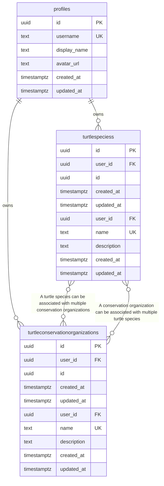

# Entity Relationship Diagram - TurtlePal

> **Auto-generated** from your idea analysis
> **Entities:** 2

---

## Visual Diagram

---

## Entity Details

### TurtleSpecies
> A turtle species entity

**Fields:**
  - `id`: uuid (required) - Primary key
  - `created_at`: datetime (required) - Creation timestamp
  - `updated_at`: datetime (required) - Last update timestamp
  - `user_id`: uuid (required) - Owner user ID
  - `name`: string (required, unique, indexed) - Name of the turtle species
  - `description`: text - Description of the turtle species

**Relationships:**
  - many_to_many → **TurtleConservationOrganization**: A turtle species can be associated with multiple conservation organizations

### TurtleConservationOrganization
> A turtle conservation organization entity

**Fields:**
  - `id`: uuid (required) - Primary key
  - `created_at`: datetime (required) - Creation timestamp
  - `updated_at`: datetime (required) - Last update timestamp
  - `user_id`: uuid (required) - Owner user ID
  - `name`: string (required, unique, indexed) - Name of the conservation organization
  - `description`: text - Description of the conservation organization

**Relationships:**
  - many_to_many → **TurtleSpecies**: A conservation organization can be associated with multiple turtle species

---

## Notes

- All entities have standard fields: `id`, `user_id`, `created_at`, `updated_at`
- `PK` = Primary Key, `FK` = Foreign Key, `UK` = Unique Key
- Copy the Mermaid code block to visualize in any Mermaid-compatible tool
- Relationships: `||--o{` = one-to-many, `||--||` = one-to-one, `}o--o{` = many-to-many
